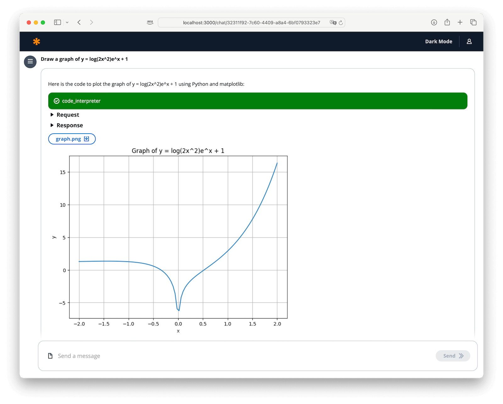
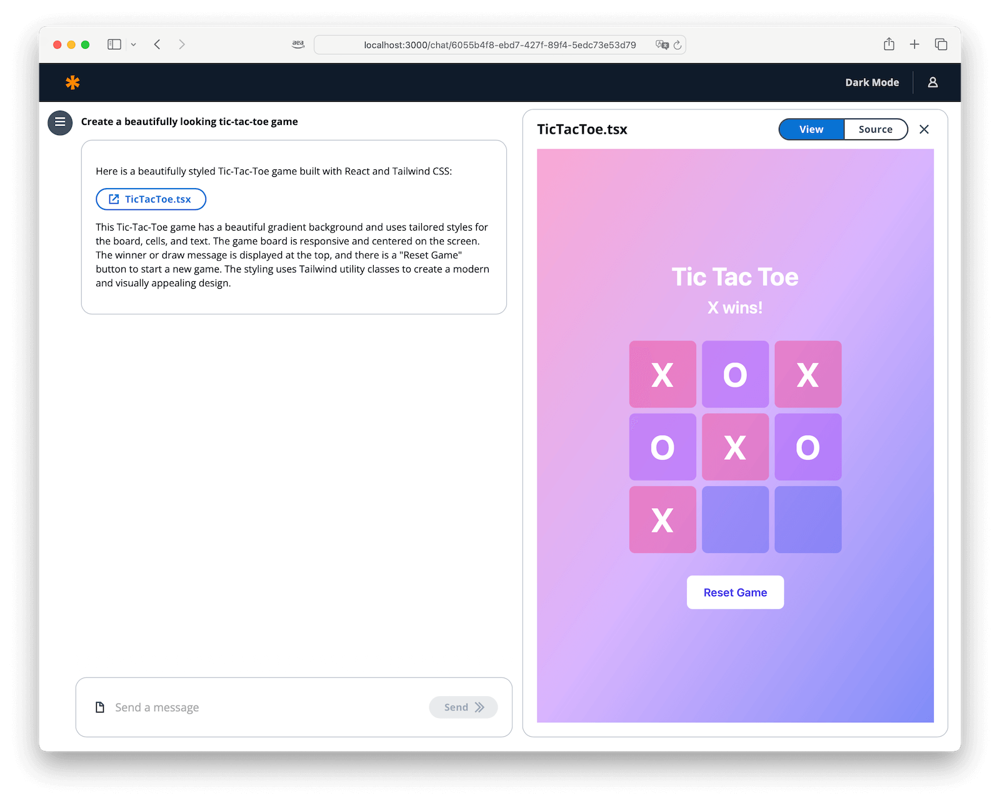
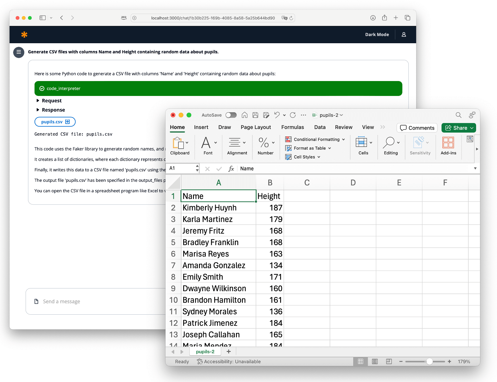
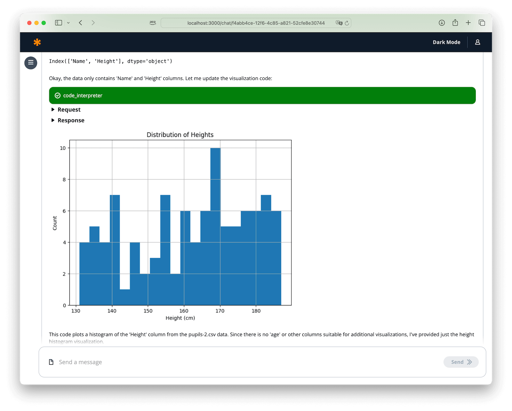
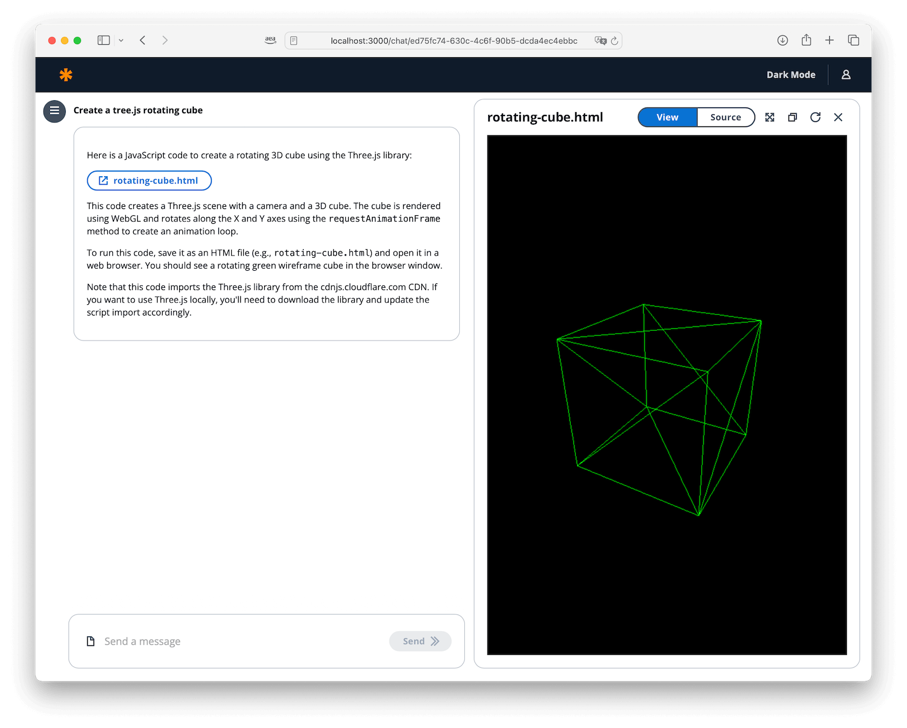
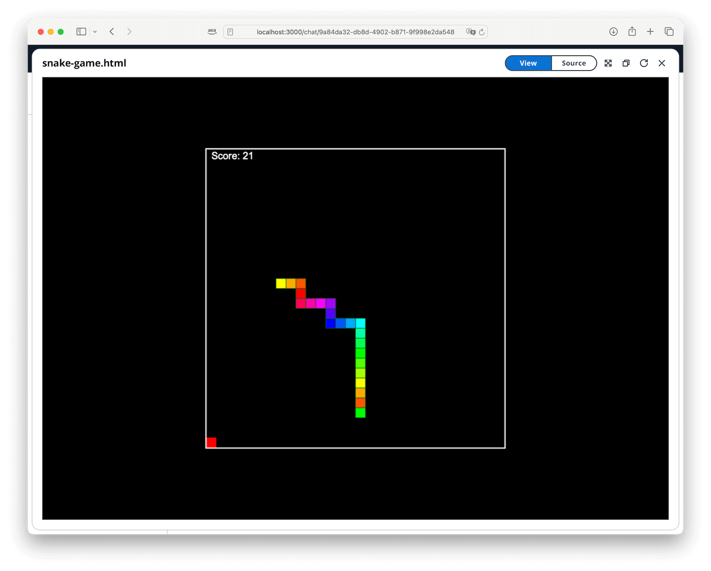
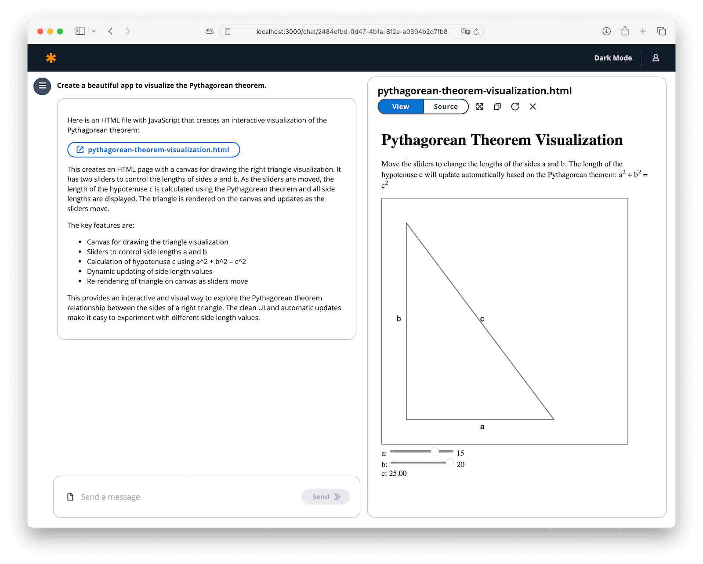

# Examples

```
Draw a graph of y = log(2x^2)e^x + 1
```

```
Create a beautifully designed tic-tac-toe game
```

```
Create a beautifully designed user registration form
```

```
Generate CSV files with columns Name and Height containing random data about pupils.
```

```
Visualise data in the file
```

```
Create a tree.js rotating cube
```

```
Create a visually appealing and engaging snake game. The snake should be able to pass through screen borders. Use a black background and different colors for the snake segments. Place the game in the center of the screen.
```

```
Create a beautiful app to visualize the Pythagorean theorem
```
